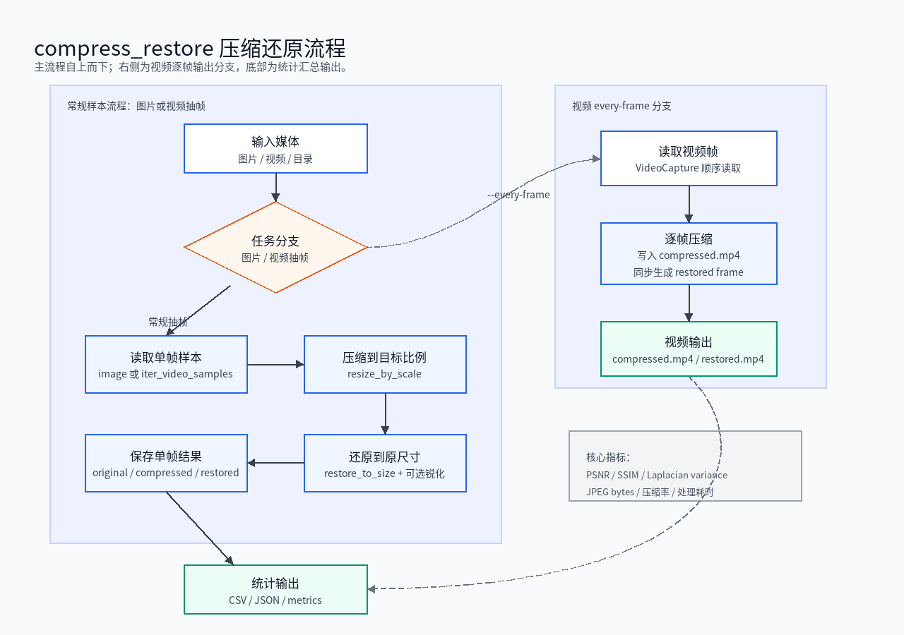
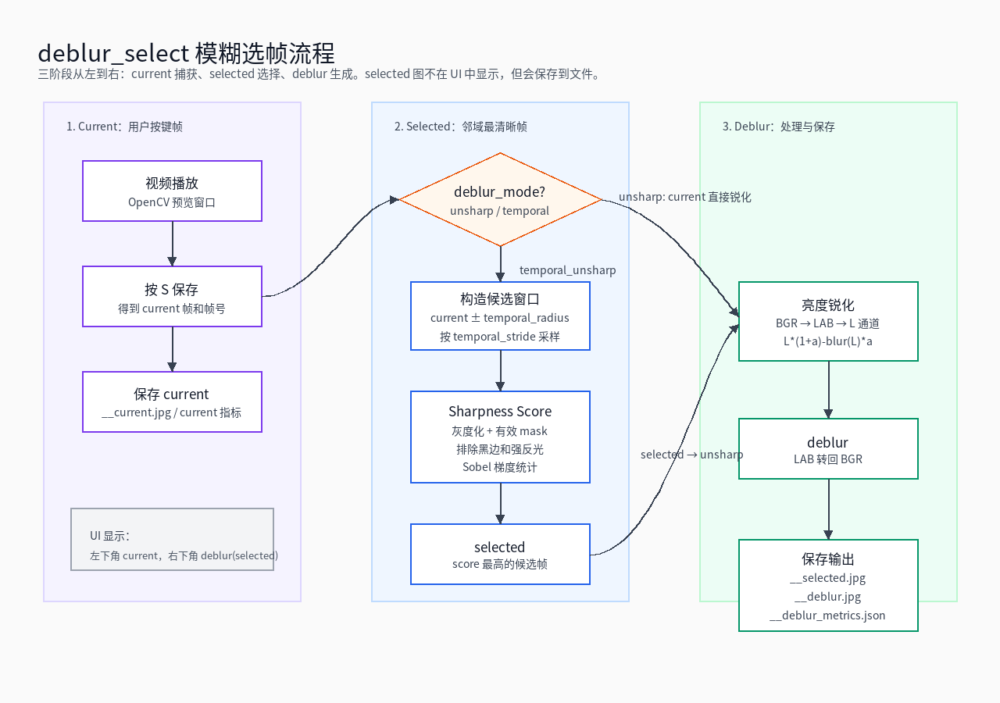

# 4K 图像/视频调试工具

本项目提供一个入口脚本 `demo.py`，当前包含两个互相独立的任务：

- `compress_restore`：压缩、还原和质量统计。
- `deblur_select`：消化内镜视频交互式选帧和非深度学习去模糊调试。

下面先介绍通用信息，然后分别说明压缩还原和去模糊选帧。

## 通用信息

### 代码结构

| 模块 | 职责 |
|------|------|
| `demo.py` | 命令行参数解析和程序入口。 |
| `algorithms.py` | 压缩还原、质量指标、selected 帧选择、deblur 处理。 |
| `processing.py` | 工作流协调、OpenCV 交互窗口、目录批处理。 |
| `summary.py` | 数据类、CSV/JSON 汇总、文件保存工具。 |
| `docs/` | 面向 C++ 端开发人员的核心流程图。 |

### 通用参数

| 参数 | 说明 |
|------|------|
| `--task` | 必填。可选 `compress_restore` 或 `deblur_select`。 |
| `--input` | 必填。输入文件或目录。 |
| `--output` | 输出目录，默认 `outputs`。 |

下面示例与 `.vscode/launch.json` 保持一致。

## 压缩还原：compress_restore

`compress_restore` 用于验证 4K/2K 图像或视频的压缩、还原和统计输出。该流程已定型，主要输出原图 JPEG、压缩 JPEG、还原 JPEG，以及 CSV/JSON 统计。

### compress_restore 流程图



### 运行示例

抽帧压缩还原：

```bash
python3 demo.py \
  --task compress_restore \
  --input /media/maxlin/SATA/compress4k-test \
  --output ./output-best-05-100-80-100 \
  --max-samples 100 \
  --sample-fps 0.5 \
  --compression-scale 0.5 \
  --original-quality 100 \
  --compressed-quality 80 \
  --restored-quality 100
```

4K 输入逐帧压缩还原并输出视频：

```bash
python3 demo.py \
  --task compress_restore \
  --input /media/maxlin/SATA/compress4k-test \
  --output ./output-best-05-100-80-100-everyframe4k \
  --compression-scale 0.5 \
  --original-quality 100 \
  --compressed-quality 80 \
  --restored-quality 100 \
  --every-frame
```

2K 输入逐帧压缩还原并输出视频：

```bash
python3 demo.py \
  --task compress_restore \
  --input /media/maxlin/SATA/compress2k-test \
  --output ./output-best-05-100-80-100-everyframe2k \
  --compression-scale 0.5 \
  --original-quality 100 \
  --compressed-quality 80 \
  --restored-quality 100 \
  --every-frame
```

### compress_restore 参数

| 参数 | 说明 |
|------|------|
| `--compression-scale` | 压缩缩放比例。`0.5` 表示宽高各缩小一半。 |
| `--original-quality` | 保存 `original_4k.jpg` 的 JPEG 质量。 |
| `--compressed-quality` | 保存 `compressed_2k.jpg` 的 JPEG 质量。 |
| `--restored-quality` | 保存 `restored_4k.jpg` 的 JPEG 质量。 |
| `--restore-sharpen` | 还原后追加的 unsharp 强度。 |
| `--detail-enhance` | 启用 OpenCV `detailEnhance`。4K 上会更慢。 |
| `--sample-fps` | 视频抽帧频率。 |
| `--max-samples` | 限制视频抽帧样本数。 |
| `--every-frame` | 逐帧处理视频并输出 MP4。 |

### compress_restore 输出

常规抽帧输出：

```text
outputs/
  summary_images.csv
  summary_videos.csv
  summary_video_frames.csv
  summary.json
  video_a/
    frame_000000_t0000.000s__original_4k.jpg
    frame_000000_t0000.000s__compressed_2k.jpg
    frame_000000_t0000.000s__restored_4k.jpg
    frame_000000_t0000.000s__metrics.json
```

其中：

- `summary_images.csv` 只看图片输入。
- `summary_videos.csv` 只看每个视频的平均结果。
- `summary_video_frames.csv` 保留逐帧记录。
- `summary.json` 保存结构化汇总。

逐帧 MP4 输出：

```text
output/
  <video_name>_compressed.mp4
  <video_name>_restored.mp4
  combined_statistics.csv
```

## 去模糊选帧：deblur_select

`deblur_select` 用于消化内镜视频的交互式选帧调试。`temporal_unsharp` 不使用深度学习模型。它会在 current 前后搜索 sharpness score 更高的 selected 帧，再对 selected 做亮度通道 unsharp。

关键算法入口：

- `select_best_frame_in_window()`：在 current 邻域内选 selected。
- `endoscopy_sharpness_score()`：内镜帧清晰度评分。
- `DeblurProcessor.apply()`：对 selected 生成 deblur。

### deblur_select 流程图



### 命名约定

| 名称 | 含义 | 保存后缀 |
|------|------|----------|
| `current` | 按 `S` 时视频窗口所在帧。 | `__current.jpg` |
| `selected` | 在 current 邻域内用 sharpness score 选出的最佳帧。 | `__selected.jpg` |
| `deblur` | 对 selected 做亮度通道 unsharp 后的结果。 | `__deblur.jpg` |

保存前缀包含保存序号、current 帧号、selected 帧号和时间戳：

```text
save_000000_cur_f001001_sel_f001004_t0033.367s__current.jpg
save_000000_cur_f001001_sel_f001004_t0033.367s__selected.jpg
save_000000_cur_f001001_sel_f001004_t0033.367s__deblur.jpg
save_000000_cur_f001001_sel_f001004_t0033.367s__deblur_metrics.json
```

### 运行示例

```bash
python3 demo.py \
  --task deblur_select \
  --input /media/maxlin/SATA/compress2k-test \
  --output ./output-deblur-select \
  --deblur-mode temporal_unsharp \
  --temporal-radius 6 \
  --temporal-stride 1 \
  --deblur-unsharp 0.55 \
  --deblur-sigma 1.2 \
  --frame-quality 100 \
  --deblur-quality 100
```

### deblur_select 参数

| 参数 | 说明 |
|------|------|
| `--deblur-mode` | `unsharp` 或 `temporal_unsharp`。 |
| `--temporal-radius` | selected 搜索半径，向前/向后各多少帧。 |
| `--temporal-stride` | selected 搜索步长。 |
| `--deblur-unsharp` | deblur 阶段 unsharp 强度。 |
| `--deblur-sigma` | deblur 阶段高斯 sigma。 |
| `--frame-quality` | current 和 selected JPEG 质量。 |
| `--deblur-quality` | deblur JPEG 质量。 |

`--selected-quality` 和 `--deblurred-quality` 仍作为旧参数别名保留，但新配置建议使用 `--frame-quality` 和 `--deblur-quality`。

### 交互按键

| 按键 | 动作 |
|------|------|
| `Space` | 播放/暂停。 |
| `A` | 后退 100 帧；如果原本在播放，跳转后继续播放。 |
| `D` | 前进 100 帧；如果原本在播放，跳转后继续播放。 |
| `S` | 保存当前调试样本，并暂停播放。 |
| `Q` 或 `Esc` | 退出当前视频。 |

调试窗口右上角 `Saved Flow` 显示的是上一次保存样本的 selected/deblur 指标；第二列 `Status` 显示的是当前视频窗口所在帧的指标。

### deblur_select 输出

```text
output-deblur-select/
  video_a/
    save_000000_cur_f001001_sel_f001004_t0033.367s__current.jpg
    save_000000_cur_f001001_sel_f001004_t0033.367s__selected.jpg
    save_000000_cur_f001001_sel_f001004_t0033.367s__deblur.jpg
    save_000000_cur_f001001_sel_f001004_t0033.367s__deblur_metrics.json
```

`deblur_metrics.json` 记录 current/selected/deblur 的帧号、时间戳、sharpness score、blur score、文件大小和参数。
